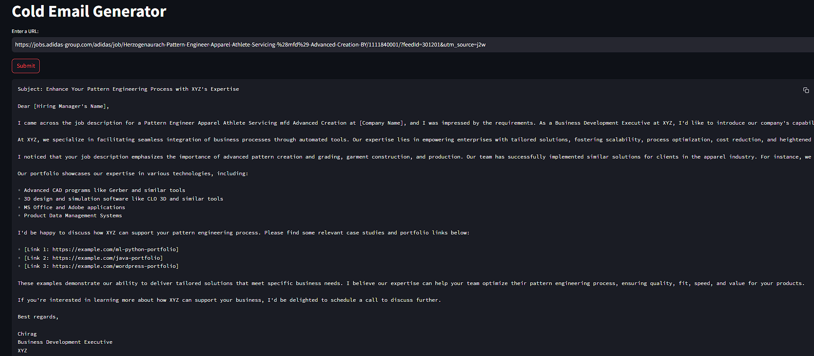

# Cold Email Generator Using ChromaDB

This project is a Cold Email Generator for service-based companies, leveraging **Groq**, **LangChain**, and **Streamlit**. The tool allows users to input the URL of a company's careers page, automatically extracts job listings from that page, and generates personalized cold emails. These emails include relevant portfolio links sourced from a vector database, based on the specific job descriptions.



## 🛠️ Use Case
Imagine a scenario:
- **Adidas** needs an AI/ML Engineer and spends time and resources in the hiring process, onboarding, training, etc.
- **TCS**, a service based company, can provide a dedicated software development engineer to Adidas.
- The business development executive, **Chirag**, from TCS, will use this tool to generate a cold email to reach out to Adidas and offer their services.

## 🧑‍💻 Architecture


## 🚀 Features
- Extract job listings from any company’s career page by simply providing the URL.
- Generate personalized cold emails for business development outreach.
- Automatically source relevant portfolio links from a vector database, matched to the job descriptions.

## 🛠️ Tech Stack
- **Groq**: For high-performance querying.
- **LangChain**: To handle natural language understanding and response generation.
- **Streamlit**: For building the user interface and web application.

## 📦 Set-up Instructions

### 1. Get a Groq API Key
To get started, you will need a `GROQ_API_KEY`. Follow the steps below:
- Go to [Groq API Console](https://console.groq.com/keys) and create an API key.
- Update the `GROQ_API_KEY` value in the `.env` file inside the `app/` directory.

### 2. Install Dependencies
Once you've cloned this repository, install the required dependencies by running:

```bash
pip install -r requirements.txt
```

### 3. Running the Streamlit App
To run the Streamlit application, use the following command:

```bash
streamlit run app/main.py
```

This will launch the app in your default browser where you can input a company's careers page URL and generate personalized cold emails.

## 🛠️ Requirements
- Python 3.8 or above
- Groq API Key

## 🤝 Contributing
Feel free to contribute to this project by submitting a pull request. Please ensure that your code follows best practices and is properly documented.

---
